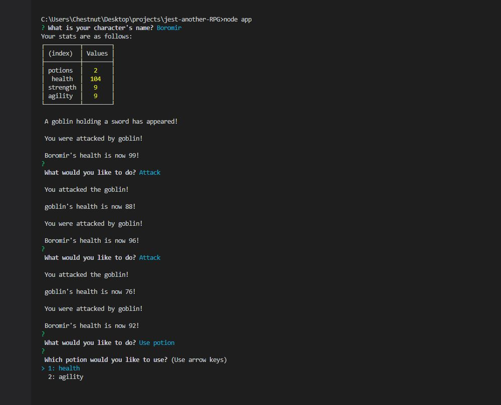

  # Jest-Another-RPG
  

  ## Description
  This is a text-based command line RPG(Role-Playing Game) where you create and name a character which will fight a series of enemies. Battles use Inquirer to choose whether to attack the enemy or use a potion for each turn. The monster will then take its turn to attack your character. This repeats until either your character or the monster's health reaches zero, if your character wins you will battle the next monster.

  

  ## Table of Contents
  * [Installation](#installation)
  * [Usage](#usage)
  * [Questions](#questions)
  * [License](#license)  

  ## Installation
  - Clone or download the repo.
  - In your terminal, navigate to the directory you want to save the app to.
  - Enter: ```git clone <url>``` 
  - Navigate to the app's directory in your terminal, and run the app with: ```node index.js```

  ## Usage
  #### Play a short but fun RPG!
  - The game is played in your command line terminal and is text based.
  - Use your keyboard's arrows and Enter key to choose options such as "attack" and "use potion".
  - Try to defeat all three monsters to win the game!

  ## Questions
  Please visit my **[GitHub profile](https://github.com/tchestnut85/)** to check out this and other projects I've created and contributed to.
  If you have any specific questions about this project, please contact me at <tchestnut85@gmail.com>.

  ## License
  
  This app is licensed under the MIT license.